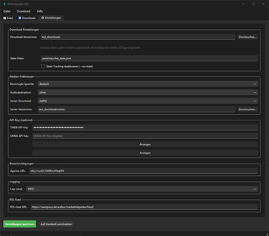
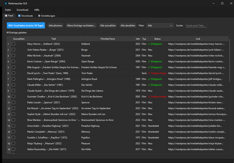
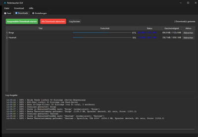

# Perlentaucher GUI - Anleitung

Eine grafische Benutzeroberfläche für Perlentaucher, die alle Funktionen der Kommandozeilen-Version über eine moderne PyQt6-basierte GUI zugänglich macht.

## Features

- **Einstellungen-Panel**: Alle konfigurierbaren Optionen als UI-Elemente
- **Blog-Liste**: RSS-Feed-Einträge in scrollbarer Liste mit Checkboxen
- **Download-Management**: Progress Bars, Status-Anzeige und Log-Ausgabe
- **Film per Suchbegriff**: Im Download-Tab kannst du einen Filmtitel (z. B. „The Quiet Girl“) eingeben und mit „Film suchen und herunterladen“ direkt in [MediathekViewWeb](https://mediathekviewweb.de) suchen und die beste Fassung herunterladen – ohne vorher den RSS-Feed zu laden
- **Cross-Platform**: Läuft auf Windows, Linux und macOS
- **Einzelnes Executable**: Kann als standalone Executable gebaut werden

## Installation

### Empfohlene Installation: Executable Download

Die einfachste Installation erfolgt über die vorgebauten Executables von der [Release-Seite](https://codeberg.org/elpatron/Perlentaucher/releases):

#### Windows

1. Lade `PerlentaucherGUI-VERSION-windows.exe.zip` von der [Release-Seite](https://codeberg.org/elpatron/Perlentaucher/releases) herunter (ersetze `VERSION` durch die aktuelle Versionsnummer, z. B. `0.1.39`)
2. Entpacke die ZIP-Datei (Rechtsklick → „Alle extrahieren“ oder Doppelklick)
3. Doppelklicke auf `PerlentaucherGUI-VERSION-windows.exe` um die Anwendung zu starten

#### Linux

1. Lade `PerlentaucherGUI-VERSION-linux.tar.gz` von der [Release-Seite](https://codeberg.org/elpatron/Perlentaucher/releases) herunter (ersetze `VERSION` durch die aktuelle Versionsnummer, z. B. `0.1.39`)
2. Entpacke die TAR.GZ-Datei:
   ```bash
   tar -xzf PerlentaucherGUI-VERSION-linux.tar.gz
   ```
3. Mache die Datei ausführbar:
   ```bash
   chmod +x PerlentaucherGUI-VERSION-linux
   ```
4. Starte die Anwendung:
   ```bash
   ./PerlentaucherGUI-VERSION-linux
   ```

#### macOS

1. Lade `PerlentaucherGUI-VERSION-macos.app.zip` von der [Release-Seite](https://codeberg.org/elpatron/Perlentaucher/releases) herunter (ersetze `VERSION` durch die aktuelle Versionsnummer, z. B. `0.1.39`).
2. Entpacke die ZIP-Datei (Doppelklick). Es entsteht das App-Bundle `PerlentaucherGUI-VERSION-macos.app`.
3. **Starten:** Doppelklick auf `PerlentaucherGUI-VERSION-macos.app` im Finder, oder im Terminal:
   ```bash
   open ~/Downloads/PerlentaucherGUI-VERSION-macos.app
   ```
4. **Gatekeeper-Warnung:** Da die App nicht von Apple signiert/notarisiert ist, kann macOS eine dieser Meldungen anzeigen:
   - *„Apple konnte nicht überprüfen, dass … frei von Schadsoftware ist“* (unbekannter Entwickler)
   - *„… ist beschädigt und kann nicht geöffnet werden. Du solltest sie in den Papierkorb verschieben.“* (typisch nach Download)

   **Schnelle Lösung (empfohlen):** Im Terminal einmalig ausführen (Pfad und VERSION ggf. anpassen):
   ```bash
   xattr -cr ~/Downloads/PerlentaucherGUI-VERSION-macos.app
   ```
   Danach lässt sich die App per Doppelklick starten.

   **Alternative (nur bei „unbekannter Entwickler“):** Rechtsklick → **„Öffnen“** → im Dialog **„Öffnen“** bestätigen. Bei der Meldung „beschädigt“ zeigt macOS nur **„Abbrechen“** bzw. **„In den Papierkorb verschieben“** – dann ist `xattr -cr` die einzige Lösung.

   **Danach (Schritt für Schritt):**
   1. Schließe ggf. offene Fehlerdialoge.
   2. Doppelklicke auf `PerlentaucherGUI-VERSION-macos.app` – die App startet nun ohne Warnung.
   3. Die Warnung erscheint beim nächsten Öffnen in der Regel nicht wieder.
   4. *(Optional)* App in den Programme-Ordner verschieben: Im Finder die App per Drag & Drop in **Programme** (Links unter „Favoriten“) ziehen.

### Alternative: Manuelle Installation für Development

Für Entwickler oder wenn du die neueste Version aus dem Quellcode benötigst:

#### Voraussetzungen

- Python 3.8 oder höher
- PyQt6 (wird automatisch installiert)

#### GUI-Abhängigkeiten installieren

```bash
pip install -r requirements-gui.txt
```

#### Manuell starten

```bash
python src/perlentaucher_gui.py
```

## Nutzung

### 1. Einstellungen konfigurieren

Im ersten Tab "⚙️ Einstellungen" können alle Optionen konfiguriert werden:

- **Download-Verzeichnis**: Zielordner für Downloads
- **RSS-Einträge**: Anzahl der zu prüfenden Blog-Beiträge
- **Sprache/Audiodeskription**: Präferenzen für Downloads
- **Serien-Download**: Verhalten für Serien (erste Episode, gesamte Staffel, überspringen)
- **API-Keys**: Optionale TMDB/OMDb API-Keys für bessere Erkennung
- **Benachrichtigungen**: Apprise-URL für Benachrichtigungen

Klicke auf "Einstellungen speichern" um die Konfiguration zu speichern.

<a href="assets/Perlentaucher-GUI-Settings.png"></a>

*Klicken Sie auf das Bild für die vollständige Ansicht*

### 2. RSS-Feed laden

Wechsle zum Tab "📰 Blog-Liste" und klicke auf "RSS-Feed laden (Letzte 30 Tage)".

**Standard-Verhalten:**
- Beim Start werden automatisch alle Einträge der letzten 30 Tage geladen
- Keine manuelle Eingabe einer Anzahl erforderlich

**Ältere Einträge nachladen:**
- Klicke auf "Ältere Einträge nachladen..." um Einträge älter als 30 Tage zu laden
- Du kannst die Anzahl der Tage eingeben (z.B. 60 für die letzten 60 Tage)
- Oder lasse das Feld leer, um alle verfügbaren Einträge zu laden
- Neue Einträge werden zur bestehenden Liste hinzugefügt (Duplikate werden vermieden)

Die Blog-Beiträge werden in einer Tabelle angezeigt mit:
- Checkbox für Auswahl
- Original-Titel
- Extrahierter Filmtitel/Serientitel
- Jahr
- Typ (Film/Serie)
- Status (Neu, bereits verarbeitet, etc.)
- Link zum Blog-Eintrag

<a href="assets/Perlentaucher-GUI-Feed.png"></a>

*Klicken Sie auf das Bild für die vollständige Ansicht*

### 3. Downloads auswählen

- Wähle die gewünschten Einträge durch Ankreuzen der Checkboxen
- Nutze "Alle auswählen" / "Alle abwählen" für schnelle Auswahl
- Filter können verwendet werden um nach Status oder Typ zu filtern
- Die Suche kann verwendet werden um nach Titel zu suchen

### 4. Downloads starten

- Klicke auf "Ausgewählte Downloads starten" im Blog-Liste-Tab
- Oder nutze die Schaltfläche im Download-Tab
- Oder nutze das Menü: Download > Ausgewählte Downloads starten (F5)

**Film per Suchbegriff (ohne RSS-Feed):**  
Im Tab „⬇️ Downloads“ findest du ein Suchfeld mit der Beschriftung „Filmtitel suchen (z. B. The Quiet Girl)“ und den Button „Film suchen und herunterladen“. Gib einen Filmtitel ein und klicke auf den Button – die Anwendung sucht in MediathekViewWeb nach der besten Übereinstimmung und startet den Download. Der Eintrag erscheint wie ein normaler Download in der Tabelle und im Log. Es ist nicht nötig, vorher den RSS-Feed zu laden.

### 5. Download-Fortschritt überwachen

Wechsle zum Tab "⬇️ Downloads":

- Alle aktiven Downloads werden mit Progress Bars angezeigt
- Status wird in Echtzeit aktualisiert
- Log-Ausgabe zeigt detaillierte Informationen
- Einzelne Downloads können mit "Abbrechen" gestoppt werden
- "Alle Downloads abbrechen" stoppt alle aktiven Downloads

<a href="assets/Perlentaucher-GUI-Download.png"></a>

*Klicken Sie auf das Bild für die vollständige Ansicht*

## Tastenkürzel

- `Ctrl+S` (macOS: `Cmd+S`): Einstellungen speichern
- `Ctrl+Q` (macOS: `Cmd+Q`): Beenden
- `F5`: Downloads starten
- `Esc`: Alle Downloads abbrechen

## Konfiguration

Die GUI nutzt die **gleiche Konfigurationsdatei wie die Quickstart-Scripts**: `.perlentaucher_config.json`. Beim Start aus dem Quellcode liegt sie im Projekt-Root; bei Standalone-Executables im aktuellen Arbeitsverzeichnis (z. B. beim Start aus dem Terminal) bzw. im Programmverzeichnis.

Dies bedeutet:
- Konfiguration, die mit dem Quickstart-Script erstellt wurde, wird automatisch von der GUI geladen
- Änderungen in der GUI werden in der gleichen Datei gespeichert und können von CLI/Wrapper-Scripts genutzt werden
- Vollständige Kompatibilität zwischen GUI und CLI

Format (kompatibel mit Quickstart-Scripts):
```json
{
  "download_dir": "./downloads",
  "loglevel": "INFO",
  "sprache": "deutsch",
  "audiodeskription": "egal",
  "state_file": ".perlentaucher_state.json",
  "no_state": false,
  "notify": "",
  "tmdb_api_key": "",
  "omdb_api_key": "",
  "serien_download": "erste",
  "serien_dir": "./downloads",
  "rss_feed_url": "https://nexxtpress.de/author/mediathekperlen/feed/"
}
```

**Hinweise:**
- `download_dir` und `serien_dir` können relative Pfade sein (wie `./downloads`) - werden relativ zum Projekt-Root interpretiert
- `serien_dir` kann leer sein - dann wird `download_dir` verwendet
- `rss_feed_url` ist GUI-spezifisch und wird von Quickstart-Scripts ignoriert (aber nicht gelöscht)
- `no_state`: Wenn `true`, wird State-Tracking deaktiviert (entspricht `--no-state` CLI-Option)

## Building als Executable (für Entwickler)

Die GUI kann als einzelnes Executable für alle Plattformen gebaut werden. Die Builds werden automatisch bei jedem Release erstellt und auf der [Release-Seite](https://codeberg.org/elpatron/Perlentaucher/releases) bereitgestellt.

Falls du selbst bauen möchtest:

### Windows

```bash
scripts\build_gui_windows.bat
```

Oder manuell:
```bash
pip install pyinstaller
pip install -r requirements-gui.txt
pyinstaller build.spec --clean
```

Das Executable befindet sich in `dist/PerlentaucherGUI.exe`

### Linux

```bash
chmod +x scripts/build_gui_linux.sh
./scripts/build_gui_linux.sh
```

Oder manuell:
```bash
pip3 install pyinstaller
pip3 install -r requirements-gui.txt
pyinstaller build.spec --clean
```

Das Executable befindet sich in `dist/PerlentaucherGUI`

### macOS

```bash
chmod +x scripts/build_gui_macos.sh
./scripts/build_gui_macos.sh
```

Oder manuell:
```bash
pip3 install pyinstaller
pip3 install -r requirements-gui.txt
pyinstaller build.spec --clean
```

Das Executable befindet sich in `dist/PerlentaucherGUI.app`

## Troubleshooting

### PyQt6 Import-Fehler

Wenn du einen Fehler wie "PyQt6 ist nicht installiert!" erhältst:

```bash
pip install PyQt6
```

### Import-Fehler mit perlentaucher

Stelle sicher, dass `src/perlentaucher.py` im gleichen Verzeichnis wie `src/perlentaucher_gui.py` liegt.

### Downloads funktionieren nicht

- Prüfe die Log-Ausgabe im Download-Tab für Fehlermeldungen
- Stelle sicher, dass alle Einstellungen korrekt konfiguriert sind
- Prüfe deine Internetverbindung

### Executable startet nicht

- Stelle sicher, dass alle Abhängigkeiten im `build.spec` enthalten sind
- Prüfe die PyInstaller-Ausgabe für fehlende Module
- Führe das Executable mit `--debug` aus um mehr Informationen zu erhalten

### macOS: App meldet „beschädigt“ oder wird blockiert

Siehe **Installation → macOS**, Schritt 4 (Gatekeeper-Warnung). Kurz: Im Terminal `xattr -cr /Pfad/zu/PerlentaucherGUI-VERSION-macos.app` ausführen, oder Rechtsklick auf die App → **„Öffnen“** wählen.

## Unterschiede zur CLI-Version

Die GUI-Version bietet die gleiche Funktionalität wie die CLI-Version, aber:

- **Interaktive Auswahl**: Du kannst explizit auswählen, welche Downloads gestartet werden sollen
- **Visuelles Feedback**: Progress Bars und Status-Anzeigen für jeden Download
- **Parallele Downloads**: Mehrere Downloads können gleichzeitig laufen (jeder Eintrag läuft in einem eigenen Thread)
- **Serien-Download-Auswahl**: Bei Serien kann vor jedem Download gewählt werden, ob nur die erste Episode oder alle Episoden heruntergeladen werden sollen
- **Einfachere Konfiguration**: UI-basierte Einstellungen statt Kommandozeilen-Argumente
- **Fenstergröße speichern**: Fenstergröße und Position werden gespeichert und beim nächsten Start wiederhergestellt

Die CLI-Version bleibt vollständig funktional und unabhängig von der GUI.
