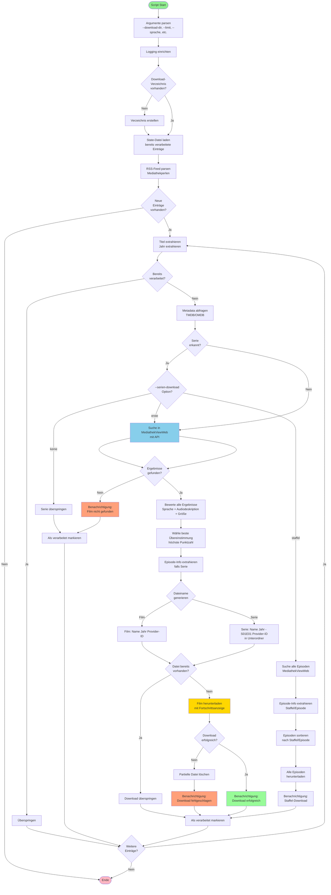

# Programmablauf

Das folgende Diagramm zeigt den vollständigen Ablauf des Scripts:

**Hauptschritte:**

1. **Initialisierung**: Argumente werden geparst, Logging konfiguriert und das Download-Verzeichnis wird erstellt (falls nicht vorhanden).

2. **RSS-Feed Parsing**: Der RSS-Feed von Mediathekperlen wird gelesen und nach neuen Einträgen durchsucht. Bereits verarbeitete Einträge werden anhand der State-Datei erkannt und übersprungen.

3. **Titel-Extraktion**: Aus jedem RSS-Eintrag wird der Filmtitel oder Serientitel (in Anführungszeichen) und das Jahr extrahiert.

4. **Metadata-Abfrage** (optional): Falls TMDB oder OMDb API-Keys konfiguriert sind, werden zusätzliche Metadaten (Jahr, Provider-ID, content_type) abgerufen. Dies hilft auch bei der Serien-Erkennung.

5. **Serien-Erkennung**: Das Script prüft, ob es sich um eine Serie handelt:
   - RSS-Feed-Kategorie "TV-Serien" (höchste Priorität)
   - Provider-ID-Prüfung über TMDB/OMDB (wenn API-Keys vorhanden)
   - Titel-Muster-Erkennung (Fallback)

6. **Serien-Verarbeitung**: Basierend auf `--serien-download` Option:
   - **`keine`**: Serien werden übersprungen
   - **`erste`**: Nur die erste Episode wird heruntergeladen (wie ein Film)
   - **`staffel`**: Alle Episoden der Serie werden gefunden, sortiert und heruntergeladen

7. **MediathekViewWeb Suche**: 
   - **Für Filme**: Normale Suche nach dem Filmtitel
   - **Für Serien**: `search_mediathek_series()` findet alle Episoden und filtert nach Serientitel

8. **Bewertung & Auswahl**: Alle gefundenen Ergebnisse werden basierend auf deinen Präferenzen bewertet:
   - **Sprache** (Deutsch/Englisch/Egal): +1000 Punkte bei Übereinstimmung
   - **Audiodeskription** (Mit/Ohne/Egal): +500 Punkte bei Übereinstimmung
   - **Dateigröße**: Größere Dateien erhalten höhere Punkte (bessere Qualität)
   - **Titelübereinstimmung**: Sehr hohe Priorität für exakte Übereinstimmungen

9. **Episode-Extraktion** (für Serien): Staffel- und Episoden-Nummer werden aus dem Titel extrahiert (unterstützt verschiedene Formate: S01E01, Saison 1 (1/8), Staffel 1 (1/8), etc.)

10. **Dateinamen-Generierung**: 
    - **Filme**: `Filmname (Jahr) [tmdbid-123].mp4`
    - **Serien**: `[serien-dir]/[Titel] (Jahr)/[Titel] (Jahr) - S01E01 [tmdbid-123].mp4`

11. **Download**: Der Film oder die Episode wird heruntergeladen. Falls die Datei bereits existiert, wird der Download übersprungen.

12. **Benachrichtigungen** (optional): Bei Erfolg, Fehler oder wenn kein Film/Serie gefunden wurde, können Benachrichtigungen via Apprise gesendet werden. Bei Staffel-Downloads wird der Fortschritt angezeigt.

13. **State-Tracking**: Jeder verarbeitete Eintrag wird in der State-Datei gespeichert, um Doppel-Downloads zu vermeiden. Bei Serien werden auch die heruntergeladenen Episoden gespeichert.

