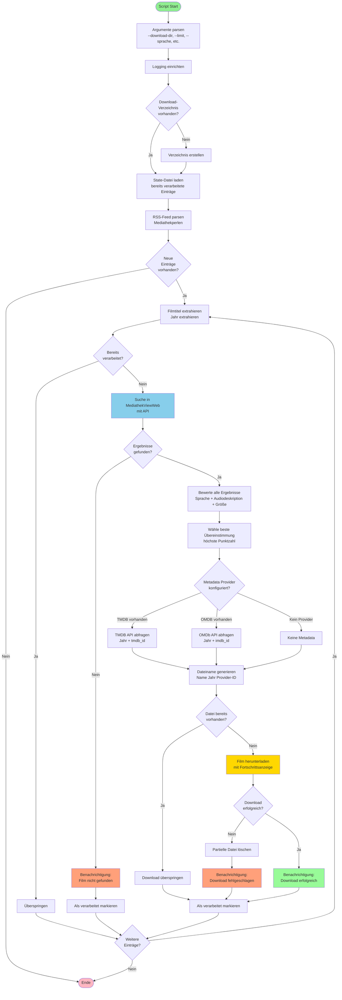

# Programmablauf

Das folgende Diagramm zeigt den vollständigen Ablauf des Scripts:

**Hauptschritte:**

1. **Initialisierung**: Argumente werden geparst, Logging konfiguriert und das Download-Verzeichnis wird erstellt (falls nicht vorhanden).

2. **RSS-Feed Parsing**: Der RSS-Feed von Mediathekperlen wird gelesen und nach neuen Einträgen durchsucht. Bereits verarbeitete Einträge werden anhand der State-Datei erkannt und übersprungen.

3. **Filmtitel-Extraktion**: Aus jedem RSS-Eintrag wird der Filmtitel (in Anführungszeichen) und das Jahr extrahiert.

4. **MediathekViewWeb Suche**: Für jeden neuen Filmtitel wird die MediathekViewWeb API durchsucht.

5. **Bewertung & Auswahl**: Alle gefundenen Ergebnisse werden basierend auf deinen Präferenzen bewertet:
   - **Sprache** (Deutsch/Englisch/Egal): +1000 Punkte bei Übereinstimmung
   - **Audiodeskription** (Mit/Ohne/Egal): +500 Punkte bei Übereinstimmung
   - **Dateigröße**: Größere Dateien erhalten höhere Punkte (bessere Qualität)

6. **Metadata-Abfrage** (optional): Falls TMDB oder OMDb API-Keys konfiguriert sind, werden zusätzliche Metadaten (Jahr, Provider-ID) abgerufen.

7. **Dateinamen-Generierung**: Der Dateiname wird im Jellyfin/Plex-kompatiblen Format erstellt: `Filmname (Jahr) [tmdbid-123].mp4`

8. **Download**: Der Film wird heruntergeladen. Falls die Datei bereits existiert, wird der Download übersprungen.

9. **Benachrichtigungen** (optional): Bei Erfolg, Fehler oder wenn kein Film gefunden wurde, können Benachrichtigungen via Apprise gesendet werden.

10. **State-Tracking**: Jeder verarbeitete Eintrag wird in der State-Datei gespeichert, um Doppel-Downloads zu vermeiden.

